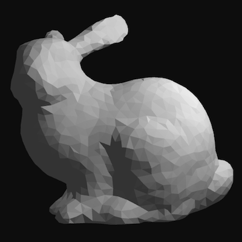

# gl-lambert-material

[![NPM version][npm-image]][npm-url]
![experimental][experimental-image]
[![js-standard-style][standard-image]][standard-url]
[![material][material-image]][material-url]

Lambert material for 3d rendering.

As defined in [`gl-material`](https://github.com/freeman-lab/gl-material), a `material` is a fragment shader and a set of styles with defaults. This material reflects lighting to produce a soft, diffuse appearence using the [`glsl-diffuse-oren-nayar`](https://github.com/stackgl/glsl-diffuse-oren-nayar) shader component. 

**[live demo](http://gl-lambert-material.surge.sh/)**

--------------------------------------
> `STYLE PARAMETERS`

> `emissive` : `vec3` emissive color (unaffected by light), default `[0.0, 0.0, 0.0]`

> `ambient` : `vec3` ambient color component, default `[0.2, 0.2, 0.2]`

> `diffuse` : `vec3` diffuse color component, default `[0.8, 0.8, 0.8]`

> `roughness` : `float` surface roughness, 0 for smooth, 1 for matte, default `0.7`

> `albedo` : `float` intensity of light reflection, 0 for dark, 1 for bright, default `0.7`

[](http://gl-lambert-material.surge.sh/)

## install

```
npm install gl-lambert-material
```

## usage

Use with [`gl-material`](https://github.com/freeman-lab/gl-material) to generate a compiled shader, given a `gl` context and constants to replace

```javascript
var lambert = require('gl-lambert-material')
var material = require('gl-material')(gl, lambert, {LIGHTCOUNT: 1})
```

Or just get the fragment shader for use elsewhere

```javascript
var fragment = require('gl-lambert-material').fragment
```

[npm-image]: https://img.shields.io/badge/npm-v1.0.2-lightgray.svg?style=flat-square
[npm-url]: https://npmjs.org/package/gl-lambert-material
[material-image]: https://img.shields.io/badge/gl--material-lambert-lightgray.svg?style=flat-square
[material-url]: https://github.com/freeman-lab/gl-material
[standard-image]: https://img.shields.io/badge/code%20style-standard-lightgray.svg?style=flat-square
[standard-url]: https://github.com/feross/standard
[experimental-image]: https://img.shields.io/badge/stability-experimental-lightgray.svg?style=flat-square
